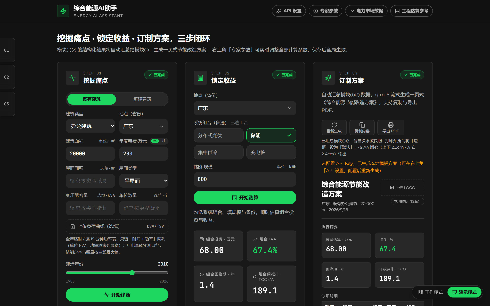
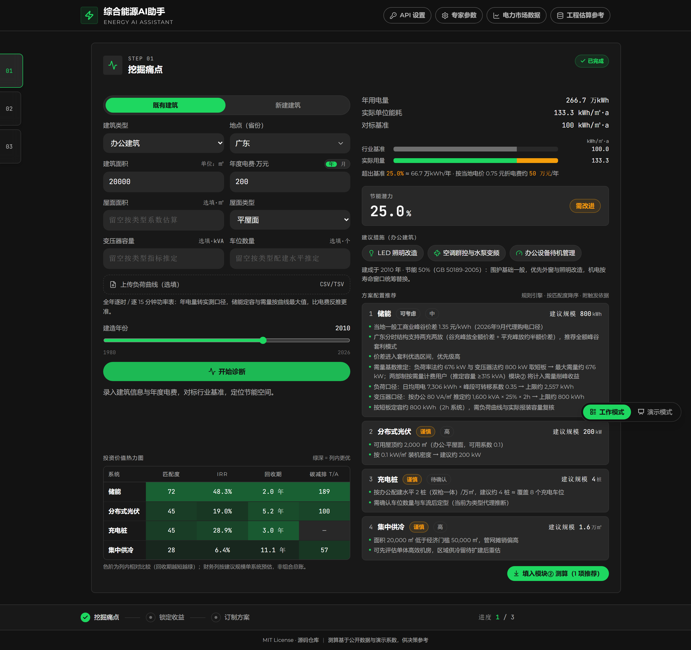
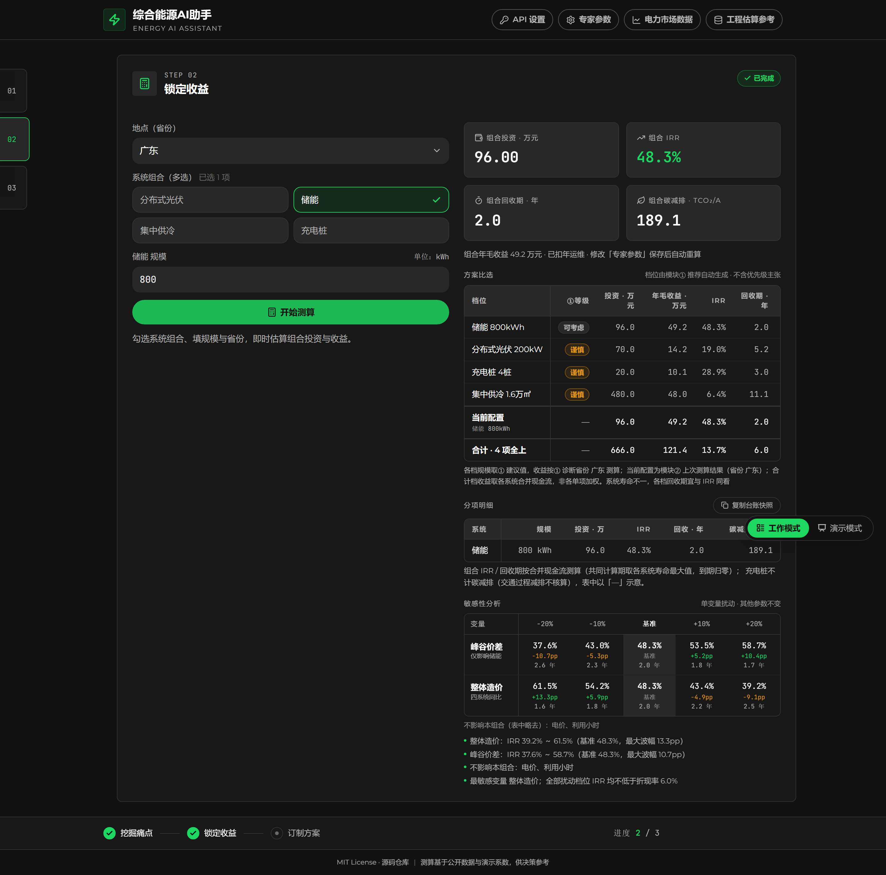
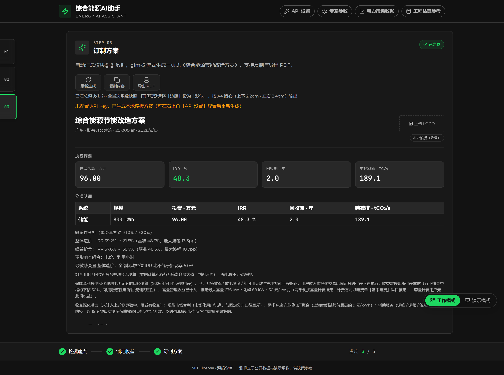

# 综合能源售前智能助手

**Energy AI Assistant** — *An AI-assisted pre-sales toolkit for integrated energy solutions: compressing a 2–3 day energy audit & proposal workflow into minutes.*

把综合能源售前「客户初诊 → 能耗对标 → 系统配置 → 收益测算 → 方案输出」的全流程，压缩到分钟级完成。

    



## 🚀 在线演示 · Live Demo

**https://topsilver94.github.io/energy-ai-assistant/**

- **零配置即可体验**：不填 API Key 时自动降级为本地模板生成，三步完整流程约 3 分钟走通
- **双界面模式（右下角切换）**：工作模式为左缘书签 + 内容分页，适合内部专注操作；演示模式三列同屏 + 左缘定位书签，点 STEP 平滑定位到该列顶部，鼠标悬浮到哪列哪列亮框聚焦，适合对外展示全貌
- 桌面浏览器优先设计；手机端可完整走通三步流程（已做移动视口回归验证），密集表格页建议电脑访问
- 页面右上角「API 设置」填入你自己的 GLM/DeepSeek Key 可体验 AI 流式成案（Key 仅存内存，不持久化）

## ❓ 它解决什么问题 · Why

中小型综合能源集成商的售前困境：能耗对标要查标准、收益测算要凑系数、方案编制靠模板拼装——一份像样的节能改造方案要 2–3 个工作日，小商机直接被成本劝退。本工具把这条链路产品化为三步闭环：**先诊断后开方**——首次接触客户能拿到的信息（面积/电费/年份）喂给第一步，第一步的推荐产出正好是第二步的输入，两步的结构化结果汇总给第三步成案。

## ✨ 三步闭环 · Three-Step Workflow

### ① 挖掘痛点 · Diagnose

录入建筑性质/类型/面积/省份与年度电费，输出单位面积能耗对标、节能潜力、能效评级与三条技术建议；内置规则引擎按屋面/负荷/配建政策推导四类系统（光伏/储能/集中供冷/充电桩）的建议规模与触发依据，一键填入下一步。

既有建筑可选上传**全年负荷曲线**（逐时 / 逐 15 分钟功率表 CSV/TSV）：年用电量转曲线实测口径、电费反推让位，储能定容与需量收益改用实测最大需量——比电费反推与典型值预估更接近现场。解析器对编码 / 分隔符 / 采样粒度 / 缺测逐项容错（客户导出的文件不会干净），口径来源与质量注记随结果透明呈现，不做无源推演。

结果区另给一张**投资价值热力图**（四类系统 × 匹配度 / IRR / 回收期 / 碳减排），以及建议规模背后的**推定链**：储能定容按负荷与变压器双口径取短板，需量基数有负荷曲线时走实测最大需量；充电桩新建读**分省配建政策档**（未收录省份与既有建筑走全国底线）；集中供冷附**客户侧全生命周期费用对比**——自建分体（电费＋维保＋折旧）对标集中供冷冷费，把客户视角的总持有成本算在明面上。一键填入模块② 时省份随推荐一并携带：①② 是同一项目的两段，电价 / 利用小时 / 峰谷价差必须同源。



### ② 锁定收益 · Evaluate

系统组合 × 规模 × 省份 → 组合总账（投资 / IRR / 回收期 / 碳减排）、分项明细与单变量敏感性分析（电价 / 峰谷价差 / 利用小时 / 整体造价四轴 ±10%/±20%），独立可用（投标测算 / 客户自带明确需求场景）；模块① 推定的储能需量基数随「填入」传入，两部制用户另计需量管理收益，无诊断数据则不计并如实注明。**方案比选**按模块① 的推荐自动生成档位——各单项一档（含谨慎/暂缓项，标出①等级）→ 当前配置档 → 合计（全上）档居末，逐档列出投资、年毛收益、回收期与碳减排；档位不排优先级也不着优劣色（规则引擎的打分衡量的是「适不适合上」而非「划不划算」，排序会替客户下一个没有依据的判断），每档构成与省份取各自测算那次的口径，表下如实标注。测算结果可一键复制为台账快照（TSV 贴入 Excel 自动分列，含当次系数版本——供影子测算与回测对账）。



### ③ 订制方案 · Generate

自动汇总 ①② 的结构化数据，流式生成一页式《综合能源节能改造方案》——报告头 / 执行摘要 / 分项明细 / 敏感性结论由版式系统确定性渲染，支持导出打印级 PDF。正文在点「生成」那一刻定格，版式区却随参数实时重算：任一侧上游数据变了就在报告区提示「上游已变，请重新生成」，不静默呈现「正文讲旧配置、数据卡是新值」的报告。



## 🏗 架构：确定性计算引擎 + LLM 表达层 · Architecture

*All financial figures, system sizing and key numbers are produced by a deterministic rule engine; the LLM only polishes the narrative — it has no authority to alter any number. A local-template fallback keeps the full workflow usable without an API key.*

这是本项目对「AI 怎样安全进入商务材料」的回答：

- **数字全部出自规则引擎**——财务测算（IRR 二分迭代 / 合并现金流）、储能定容（负荷×变压器双口径取短板）、建设节奏、敏感性结论均为确定性派生，同样输入必得同样输出，可复算、可审计
- **LLM 只有表达权，没有数字修改权**——AI 收到的是结构化结果与「仅润色措辞」的契约，报告的数据卡与全部表格由前端版式系统确定性渲染，AI 一个数字都不经手
- **无 Key 降级**——未配置或调用失败自动回退本地模板，核心流程不依赖大模型可用性，幻觉风险被挡在商务材料之外

## 📊 数据与口径 · Data & Methodology

所有计算系数集中在动态配置中心，由页头三个抽屉分层管理：

| 抽屉 | 内容 | 性质 |
|---|---|---|
| ⚙️ 专家参数 | 四系统可调系数 + 财务假设 | 演示假设值为主，面板可调 |
| 📈 电力市场数据 | 分省电价 / 峰谷价差 / 分时结构 / 利用小时 / 电网排放因子 | 公开数据，按月/季/年分层更新 |
| 🗄 工程估算参考 | 屋面 / 供冷 / 配建 / 储能定容 / 能耗基准 | 按建筑类型查表的方案阶段估算 |

**每个系数带来源标注**（真实公开数据 / 政策口径 / 演示假设三级），数据截至日期见应用内各分组标注；分省数据换版收敛为少量日期常量与表值修改。收益模型经工程校准——储能计入充放电效率 / 放电深度 / 可用天数与需量管理（按两部制政策门槛），并明示代理购电 / 市场化口径边界。

## 🔧 本地运行 · Getting Started

```bash
npm install     # 纯前端，零外部依赖
npm run dev     # 本地开发（Vite）
npm run lint    # ESLint
npm run build   # 生产构建
```

技术栈：React 18 · Vite · Zustand · Tailwind CSS · react-markdown · Playwright（验证）。

## ✅ 验证体系 · Verification

Playwright 驱动的端到端回归覆盖三模块、配置中心、双界面模式、打印版式与移动视口——模拟真实用户操作路径，数值与手算基线逐位对照；lint 为提交门禁。脚本位于 `verify/`，可独立复跑。

## 📄 License

[MIT](LICENSE)
